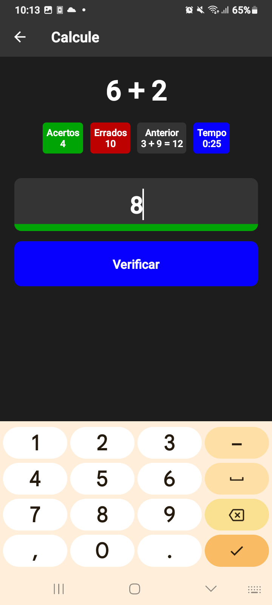

# Math-Right

Um simples gerador de cálculos com pontuação. 

 |  | 
:---: | :---: | :---:

## Usado

- [Expo](https://expo.dev)
- [React](https://react.dev)
- [React Native](https://reactnative.dev)
- [React Navigation](https://reactnavigation.org/)
- [React Native Picker](https://github.com/react-native-picker/picker)

## Desenvolvimento

### Preciso

- Node 18 LTS
- Npm
- Yarn
- `expo-cli`
- `eas-cli`


### Iniciar projeto
```bash
git clone 'https://github.com/andrey-tar-xz/math-right.git'
cd math-right
yarn install
```

### Executar
```bash
# iniciar projeto
yarn start

# Iniciar sem cache
yarn start --reset-cache

# Iniciar web
yarn web

# Gerar Apk
npx eas build -p android --profile preview
```

## License

```
Copyright 2023 Leydson Andrey

Licensed under the Apache License, Version 2.0 (the "License");
you may not use this file except in compliance with the License.
You may obtain a copy of the License at

http://www.apache.org/licenses/LICENSE-2.0

Unless required by applicable law or agreed to in writing, software
distributed under the License is distributed on an "AS IS" BASIS,
WITHOUT WARRANTIES OR CONDITIONS OF ANY KIND, either express or implied.
See the License for the specific language governing permissions and
limitations under the License.
```
